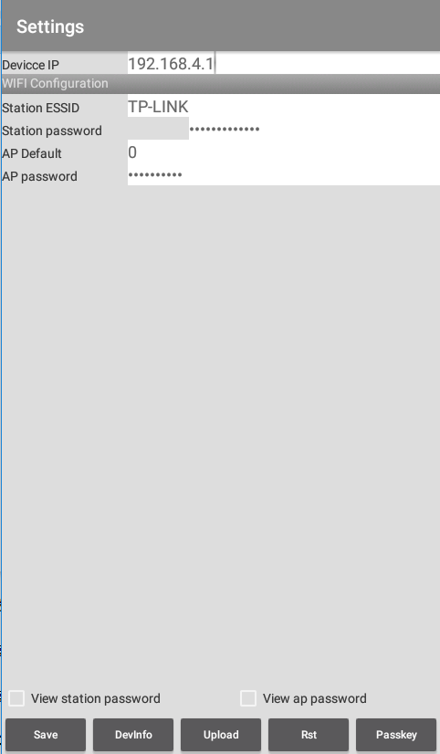
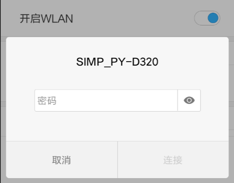
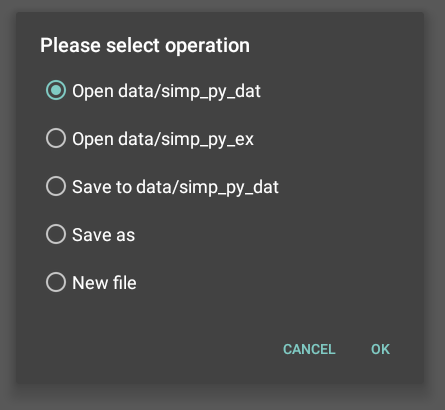
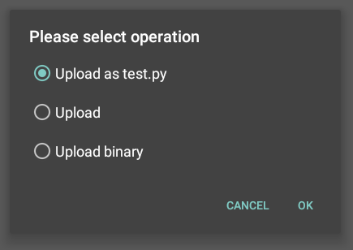
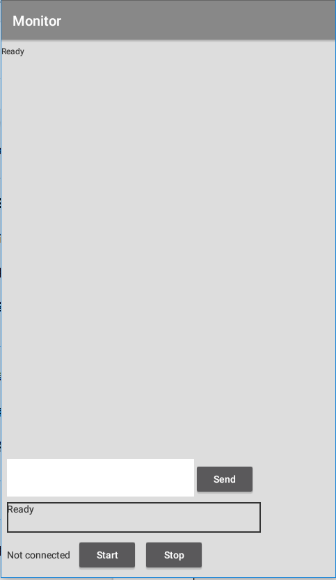
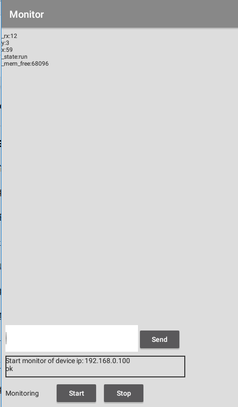
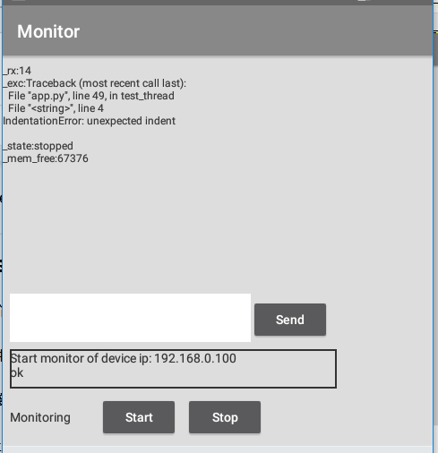

# 使用 Android simp-py 編程軟件

## 編程頁

上圖是軟件運行後出現的是編程頁面。
上部為編程區，其下是狀態欄，最低一排從左至右分別是:
文件名: 開始時空白。
跟著的一排按鍵順序是:
[File] : 啟動文件操作。
[Set..]  : 啟動設置操作。
[Ping] : 測試與MCU 的連接路徑是否通暢。
[Upld] : 上載程式至MCU.
[Rst] : 重啟MCU.
[Mon] : 監察MCU程式運行狀況
[Help] : 寻求幫助

## 設置頁

在編程頁按[Set..] 便進入此頁面。

### 第一部分設定要連接MCU的網絡地址
MCU的網絡地址會顯示在MCU的默認開機頁上，見圖2。把有關資料輸入到Device IP欄內，如: 192.168.4.1
修改後按[Save]儲存。

由於MCU默認自己為無線熱點，因此你需把手機的wifi 連上它，根據MCU 顯示的資料(ESSID)找到熱點

如上圖，按連線，輸入密碼(默認為12345678)。
連接成功後，按[DevInfo]，狀態行會顯示 Send ginfo to 192.168.4.1， 然後會出 ok。手機和MCU 成功通訊了。

如果想MCU 連到現場的無線路由器，可進入下面第二部分。否則可跳過第二部分。

### 第二部分是無線網絡設置

如果想把MCU 連接到現場的無線路由器。需設定以下參數:
Station ESSID : 現場無線路由器的名稱。
Station password : 有關路由器的密碼。
AP Default : 如果要MCU馬上連到無線路由器，此欄要設為0。
AP password : 如果MCU無法連上無線路由器，它會變回熱點，此欄是熱點的密碼。

按[Save]，然後按[Upld]，按[ok] ，狀態行會顯示 Send wifi config to 192.168.4.1， 然後顯示 ok。然後按[Rst]，狀態行會顯示 Send reset to 192.168.4.1 ，然後顯示ok。MCU會重新啟動。

MCU重新啟動時會先顯示 scanning. ..。此時MCU在嘗試連接到現場無線路由器。如果連接成功，MCU的默認開機頁面的SSID 和 網絡地址(IP address) 會顯示新的資訊。

由於MCU 已連到路由器，本身的熱點不再存在。所以此時手機和MCU會失去聯絡。要重新連接，手機需要先把wifi 連到相同的路由器。然後在Device IP 欄輸入MCU顯示的網絡地址。按[Save]。按[DevInfo]，如果狀態欄顯示ok，手機和MCU便能成功通訊了。

按[Back] 返回編程頁。

## 文件操作

在編程頁按[File]會出現文件對話框.

* 選項 Open data/simp_py_dat : 查看data/simp_py_dat 文件夾. 這裡存放用戶文件.
* 選項 Open data/simp_py_ex : 查看data/simp_py_ex 文件夾.這裡存放例子程式
* 選項 Save to data/simp_py_dat : 把文件存入data/simp_py_dat 文件夾內.
* 選項 Save as : 把文件存入data/simp_py_dat 文件夾內, 但用新文件名.
* 選項 New file : 用新文件名, 並清除編程區內容.

如果不想作任何文件操作，按[Cancel]返回。

## 上轉程式至MCU

任何時候，都可按[Ping]檢查手機與MCU的連接是否暢通。

按[Upld], 出現 Upload dialog

* 選項 Upload as test.py : 把文件上傳MCU 存放為test.py,MCU 重新啓動後會運行此程式.
* 選項 Upload : 把文件上傳MCU 存放為原文件名.
* 選項 Upload binary : 把文件當作二進製文件上傳MCU, 適用於jpeg等文件.

按[ok], 程式便傳送到MCU上。
狀態行會顯示 Sending content to ….。視乎文件大小，大的文件需時較長，傳送完成會顯示ok。

按[Rst] 令MCU重新啟動。MCU 重新啟動後便會運行你剛上傳為test.py 的程式。

## 監察頁

### 在監察頁進行監測

按[Mon]進入監察頁。按[Start]開始監察。

上圖是在監測ex002_random.py 的結果.
資料在監察啟動後會不停更新。

可見x會在0至128之間變動，而y會在0至64之間變化。由於MCU oled的點數是128 x 64，所以所產生的點便會在oled 上顯示出來。

監察區內以“_” 開的資料始，表示和系統有關的。
_rx 表示電腦從MCU收到資料的次數。
_mem_free 是MCU 的閒置記憶體數量。
_state : run 表示用戶程式在運行中。如果是stop 則表示用戶程式已經結束。

上圖是在監測ex004_fix_me.py 的結果. 指出文件第四行縮排錯誤.

如要離開監察頁，先按[Stop]，然後按[Back]離開。

### 在監察頁和MCU 互動

把 ex003_remote_song.py 上傳並運行.
按[Mon] 進入監察頁。在右下輸入欄輸入“jingle bells” (不要打“”) ，按[Send] ，狀態欄會先顯示“send out msg” ，然後顯示“jingle bells played” 。這時蜂鳴器會播出 jingle bells 。等音樂播完，你可以在輸入欄輸入“little lamb” 。按[Send]。如果狀態欄顯示“little lamb played” ，蜂鳴器就會播出 little lamb。但如果你打錯字或輸入其他名稱，狀態欄就會顯示“no music played”

