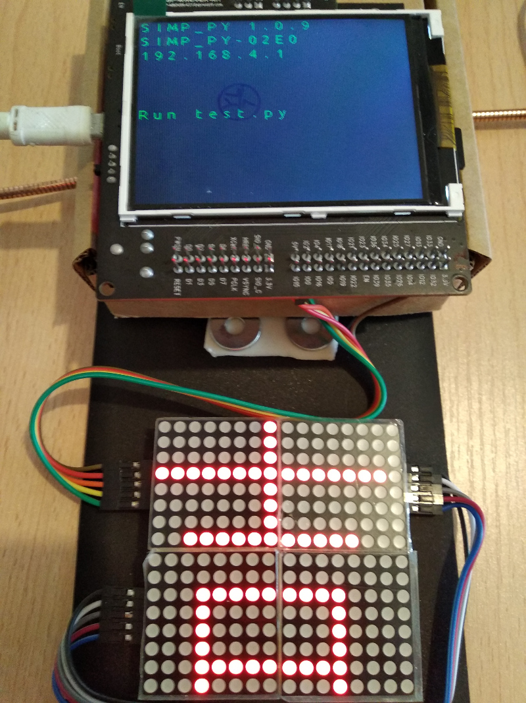
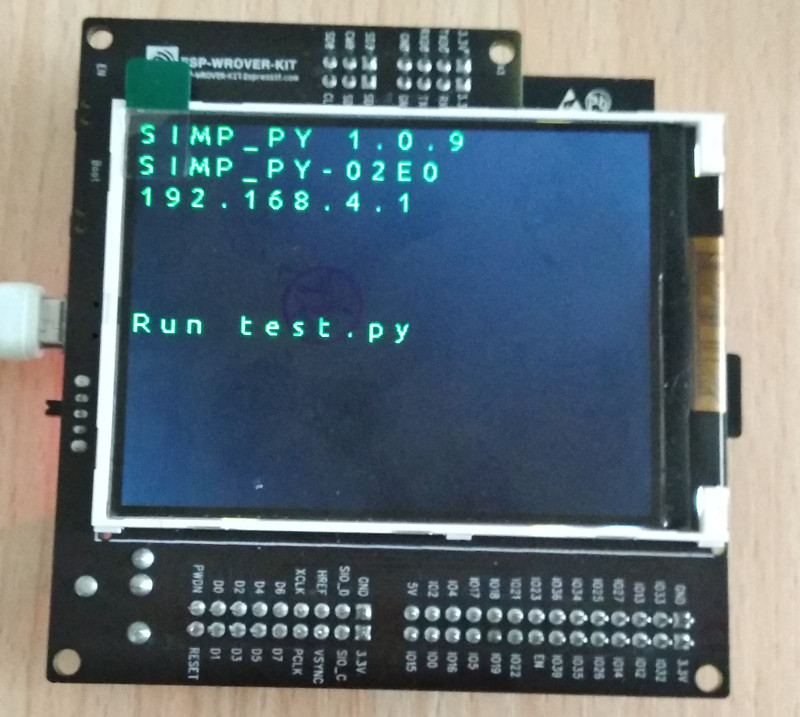

# ESP-Wrover-kit 實驗套件

##套件內容

為了方便實習，建議套件應包括下列零件:

1. ESP-Wrover-kit 模塊
2. 電線 若干。
3. 8x8 led 點陣屏(MAX 7219 驅動) 4塊

## 接線圖

## 連接並運行  -> 默認開機頁面

如上圖，把零件連接好，插上USB線供電。

TFT LCD 顯示以下信息:
SIMP_PY     板本，例如 1.0.9
Wifi 接入點的名稱 (SSID) 例如 SIMP_PY-D320
網絡地址(IP address)，例如 192.168.4.1

http://esp-idf.readthedocs.io/en/latest/get-started/get-started-wrover-kit.html#get-started-esp-wrover-kit-board-front

