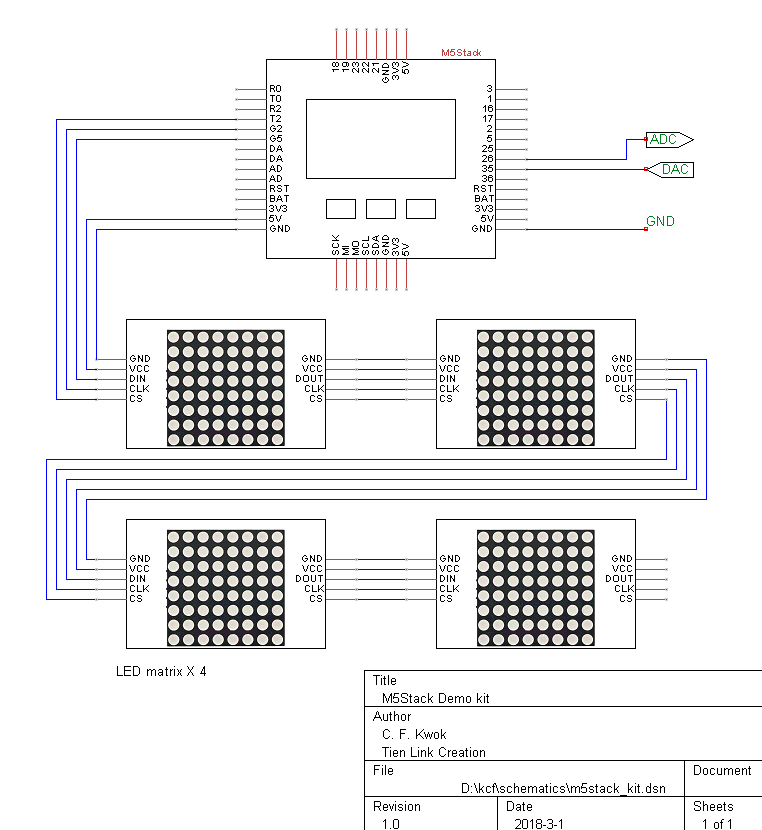
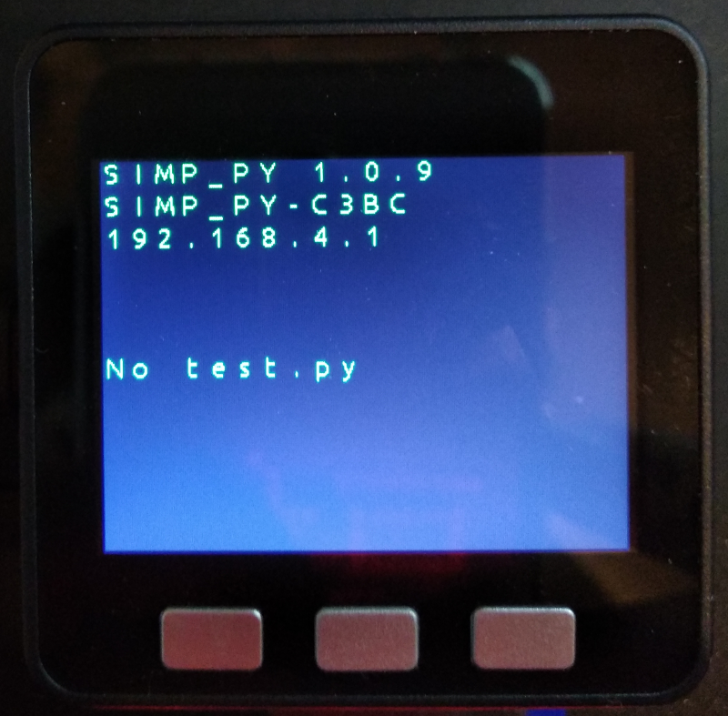

# Suggested Kit for M5Stack testing

## Kit content

The kit may contains following content in order to run the examples
1. M5Stack module
2. wires
3. led matrix (spi bus drived with MAX7219) x 4

## Wiring diagram

## Start up screen
Connect the components as shown in above diagram

TFT LCD will show following messages:
SIMP_PY Version e.g. 1.0.9
Wifi Access point name (SSID) e.g SIMP_PY-D320
Network IP Address, e.g. 192.168.4.1

