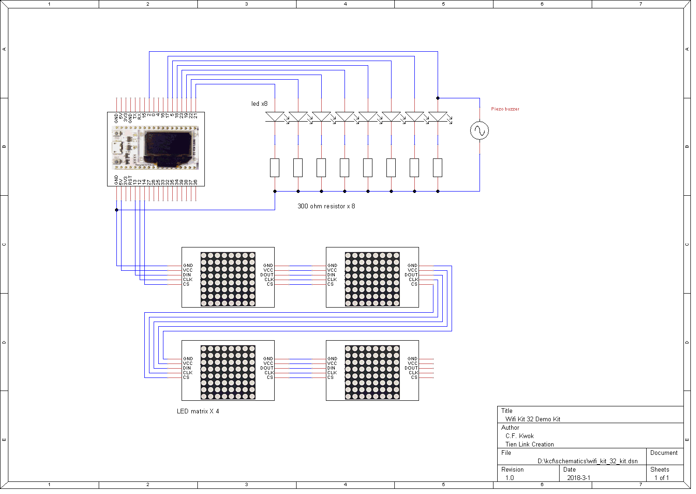

# Suggested Kit for Wifi kit 32 testing

## Kit content
The kit may contains following content in order to run the examples
1. Wifi kit 32 module
2. breadboard
3. led x 8
4. 300 ohm resistor x8 
4. piezo buzzer
5. wires
6. led matrix (spi bus drived with MAX7219) x 4

## Wiring diagram

## Start up screen
Connect the components as shown in above diagram

Oled will show following messages:
SIMP_PY Version e.g. 1.0.9
Wifi Access point name (SSID) e.g SIMP_PY-D320
Network IP Address, e.g. 192.168.4.1
