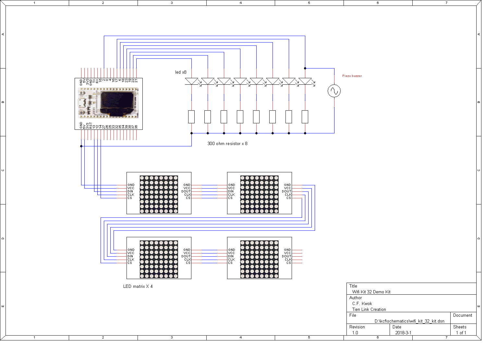

# Wlfi kit 32 實驗套件

##套件內容

為了方便實習，建議套件應包括下列零件:

1. Wifi kit 32 模塊
2. 試驗電路板(breadboard，有稱“面包板)
3. 發光二極管(led) 8 粒
4. 蜂鳴器 1 只
5. 電線 若干。
6. 8x8 led 點陣屏(MAX 7219 驅動) 4塊

## 接線圖

## 連接並運行  -> 默認開機頁面

如上圖，把零件安放在麵包板上並連接好，插上USB線供電。

Oled 顯示以下信息:
SIMP_PY     板本，例如 1.0.9
Wifi 接入點的名稱 (SSID) 例如 SIMP_PY-D320
網絡地址(IP address)，例如 192.168.4.1

